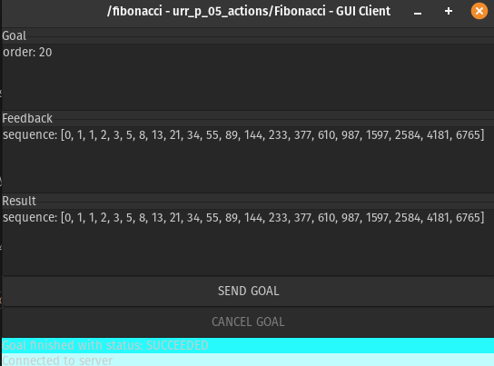

# 05 Actions (Python)

### 1. Create Package
- Change directory into `~catkin_ws/src/urr_ros_python/` stack folder.
- Create a new package called `urr_p_05_actions` which depends on `message_generation, message_runtime, actionlib_msgs and rospy` :
```bash
# Create package
catkin_create_pkg urr_p_05_actions message_generation message_runtime actionlib_msgs rospy
# dependencies can also add later after creating package we will see further
```
For more info about catkin_package [click here](http://wiki.ros.org/ROS/Tutorials/CreatingPackage)


### 2. Creating a action
-  Let's define a new action in the package
```bash
roscd urr_p_05_actions   # Change directory
mkdir action   #create 'action' directory
touch action/Fibonacci.action    # Create 'Fibonacci.action' file in action folder
# Note: Naming convention of action file starts with capital case.
```

- Now edit the `Fibonacci.action ` file
```bash
#goal definition
int32 order
---
#result definition
int32[] sequence
---
#feedback
int32[] sequence
```
- Now add below line to `package.xml`  file
```xml
<build_depend>message_generation</build_depend>
<build_depend>actionlib_msgs</build_depend>
<build_export_depend>actionlib_msgs</build_export_depend>
<exec_depend>message_runtime</exec_depend>
<exec_depend>actionlib_msgs</exec_depend>
```

- Now add below line to `CMakeLists.txt`  file
  - Add the *message_generation*, *actionlib_msgs* dependency to the find_package 
  ```bash
  find_package(catkin REQUIRED COMPONENTS
    rospy
    actionlib_msgs
    message_generation
  )
  ```
 
  - Uncomment add_action_files() by removing the # symbols and add Fibonacci.action file, such that it looks like this:
  ```bash
  add_action_files(
    FILES
    Fibonacci.action
  )
  ```
   - Add *message_runtime*, *actionlib_msgs* to *CATKIN_DEPENDS*.
  ```bash
  catkin_package(
    ...
    CATKIN_DEPENDS rospy actionlib_msgs message_runtime  ...
    ...)
  ```
  - Now uncomment *generate_messages()*  and *actionlib_msgs* to DEPENDENCIES.
  ```bash
  generate_messages(
    DEPENDENCIES actionlib_msgs
  )
  ```

### 3. Build package and services
```bash
roscd ; cd ..   #~/catkin_ws
catkin_make
```
### 4. Check for generated action messages
- Let's make sure that ROS can see new action messages.
- Use `rosmsg list` to see available service types:
  ```bash
  rosmsg list | grep Fibonacci
  ```
  you can see output like this:
  ```bash
  urr_p_05_actions/FibonacciAction
  urr_p_05_actions/FibonacciActionFeedback
  urr_p_05_actions/FibonacciActionGoal
  urr_p_05_actions/FibonacciActionResult
  urr_p_05_actions/FibonacciFeedback
  urr_p_05_actions/FibonacciGoal
  urr_p_05_actions/FibonacciResult
  ````
  where, *`urr_p_05_actions` is package name* and *`Fibonacci*` is message type.*


### 5. Action server node
`~action_server.py`
```python
#! /usr/bin/env python3

import rospy

from actionlib import SimpleActionServer

from urr_p_05_actions.msg import FibonacciFeedback
from urr_p_05_actions.msg import FibonacciResult
from urr_p_05_actions.msg import FibonacciAction

class FibonacciActionServer(object):
    # create messages that are used to publish feedback/result
    feedback = FibonacciFeedback()
    result = FibonacciResult()

    def __init__(self, name):
        self.action_name = name
        self.action_server = SimpleActionServer(self.action_name, FibonacciAction, execute_cb=self.execute_cb, auto_start = False)
        self.action_server.start()
      
    def execute_cb(self, goal):
        # helper variables
        r = rospy.Rate(1)
        success = True
        
        # append the seeds for the fibonacci sequence
        self.feedback.sequence = []
        self.feedback.sequence.append(0)
        self.feedback.sequence.append(1)
        
        # publish info to the console for the user
        rospy.loginfo('%s: Executing, creating fibonacci sequence of order %i with seeds %i, %i' % (self.action_name, goal.order, self.feedback.sequence[0], self.feedback.sequence[1]))
        
        # start executing the action
        for i in range(1, goal.order):
            # check that preempt has not been requested by the client
            if self.action_server.is_preempt_requested():
                rospy.loginfo('%s: Preempted' % self.action_name)
                self.action_server.set_preempted()
                success = False
                break
            self.feedback.sequence.append(self.feedback.sequence[i] + self.feedback.sequence[i-1])
            # publish the feedback
            rospy.loginfo('publishing feedback ...')
            self.action_server.publish_feedback(self.feedback)
            # this step is not necessary, the sequence is computed at 1 Hz for demonstration purposes
            r.sleep()
          
        if success:
            self.result.sequence = self.feedback.sequence
            rospy.loginfo('%s: Succeeded' % self.action_name)
            self.action_server.set_succeeded(self.result)
        
if __name__ == '__main__':
    rospy.init_node('fibonacci')
    server = FibonacciActionServer(rospy.get_name())
    rospy.spin()
```
### 6. Action client node
`~action_client.py`
```python
#! /usr/bin/env python3

import rospy
import actionlib
import sys

from urr_p_05_actions.msg import FibonacciAction
from urr_p_05_actions.msg import FibonacciGoal


def fibonacci_client():
    # Creates the SimpleActionClient, passing the type of the action
    # (FibonacciAction) to the constructor.
    client = actionlib.SimpleActionClient('fibonacci', FibonacciAction)

    # Waits until the action server has started up and started
    # listening for goals.
    client.wait_for_server()

    # Creates a goal to send to the action server.
    goal = FibonacciGoal(order=20)
    # Sends the goal to the action server.
    client.send_goal(goal)
    # Waits for the server to finish performing the action.
    client.wait_for_result()

    # Prints out the result of executing the action
    return client.get_result()  # A FibonacciResult

if __name__ == '__main__':
    try:
        # Initializes a rospy node so that the SimpleActionClient can
        # publish and subscribe over ROS.
        rospy.init_node('fibonacci_client_py')
        result = fibonacci_client()
        print("Result:", ', '.join([str(n) for n in result.sequence]))
    except rospy.ROSInterruptException:
        print("program interrupted before completion", file=sys.stderr)
```

`~action_client_nowait.py`
```python
....
    # Creates a goal to send to the action server.
    goal = FibonacciGoal(order=20)
    # Sends the goal to the action server.
    client.send_goal(goal)
    # Goal State
    # PENDING = 0
    # ACTIVE = 1
    # DONE = 2
    # WARN = 3
    # ERROR = 4

    result_state = client.get_state()
    rate = rospy.Rate(1)
    rospy.loginfo("result_state: "  + str(result_state))
    counter = 0
    while result_state < 2:
        rospy.loginfo("doing some other stuff while waiting for result...")
        counter += 1
        rate.sleep()
        result_state = client.get_state()
        rospy.loginfo("result_state: "  + str(result_state))

    # Prints out the result of executing the action
    return client.get_result()  # A FibonacciResult
....
```
`~action_client_preemting.py`
```python
....
    counter = 0
    while result_state < 2:
        rospy.loginfo("doing some other stuff while waiting for result...")
        counter += 1
        rate.sleep()
        result_state = client.get_state()
        rospy.loginfo("result_state: "  + str(result_state))

        if counter == 3:
            rospy.loginfo("Cancelling Goal..")
            client.cancel_goal()
            rospy.logwarn("Goal Canceled")
            result_state = client.get_state()
            rospy.loginfo("Update result_state after cancel: "+str(result_state)+", counter ="+str(counter))

    # Prints out the result of executing the action
    return client.get_result()  # A FibonacciResult
....
```
Don't forget to make the nodes executable:

 ```bash
 roscd urr_p_05_actions/scripts
 chmod +x *
 ```
Don't forget to add scripts to CMAKELists.txt:
```cmake
catkin_install_python(PROGRAMS scripts/action_server.py scripts/action_client.py
  scripts/action_client_nowait.py scripts/action_client_preemting.py
  DESTINATION ${CATKIN_PACKAGE_BIN_DESTINATION}
)
```
### 7. Build
```bash
roscd ; cd .. #~/catkin_ws
catkin_make
```
### 8. Running nodes
- ####  Running the server
   
    ```bash
    roscore # Make sure that a roscore is up and running
    rosrun urr_p_05_actions action_server.py
    ```
- ####  Check action server is online and running
    type below command
     ```bash
    rostopic list
    ```
    output:
    ```bash
    ....
    /fibonacci/cancel
    /fibonacci/feedback
    /fibonacci/goal
    /fibonacci/result
    /fibonacci/status
    ....
    ```
    use `rostopic type` to see type of message used by topic and `rosmsg show` to see message details.

- ####  Running the client
   ```bash
   rosrun urr_p_05_actions action_client.py
   ```
    output:
   ```bash
    Result: 0, 1, 1, 2, 3, 5, 8, 13, 21, 34, 55, 89, 144, 233, 377, 610, 987, 1597, 2584, 4181, 676
   ```
    you can also listen to above `/fibonacci/*` topics to see feedback, result, status... 
- ### actionlib_tools(GUI)
   ```bash
   rosrun actionlib_tools axclient.py /fibonacci
   ```
   
When you are done, press Ctrl-C to terminate  the server node.


### 9. Usefull commands
Cheat Sheet [click here](https://gitlab.com/botforge-robotics/urr_ros_python/-/blob/main/docs/ROScheatsheet.pdf)
Ros Wiki [click here](http://wiki.ros.org/ROS/CommandLineTools)